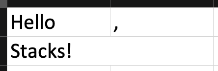

# FluentSpreadsheets

### FluentSpreadsheets

[](https://www.nuget.org/packages/FluentSpreadsheets/)

### FluentSpreadsheets.ClosedXML

[](https://www.nuget.org/packages/FluentSpreadsheets.ClosedXML/)

## Overview

### FluentSpreadsheets library consists of two APIs:

- Component API\
  An API that provides a set of `components`, that can be used for building static UI with sheet cells as building
  blocks,
  as well as base logic for drawing defined component composition on the sheet.
- Sheets API\
  An API that provides a set of abstractions to define `sheet segments` that will dynamically build components,
  providing a way to build dynamic UI based on given data, as well as a way to combine an output from sheet segments
  into a single component
  representing a built table.

## Examples

- [Student table](Examples/FluentSpreadsheets.Examples.Students)

## Component API

The base unit of component API is `IComponent` interface, it provides a basic interface to interact with all components.

```csharp
public interface IComponent
{
    Size Size { get; }

    void Accept(IComponentVisitor visitor);
}
```

There are many derived interfaces from `IComponent` used to reflect on component type in `IComponentVisitor`.

All component implementations are internal, so to create an instance of a component you need to use a static
class `ComponentFactory`.

#### Hint

> You can import static members of `ComponentFactory` for clener code.
> ```csharp
> using static FluentSpreadsheets.ComponentFactory;
> ```

### Usage

- Use `.Label` to create a label component. You can pass a `string` to it, or use a generic overload which will
  call `ToString`
  on the passed object (`IFormattable` overload supported).
    ```csharp
    Label("Hello, World!");
    Label(2.2, CultureInfo.InvariantCulture);
    ```

- Use `.VStack` & `.HStack` to stack components vertically or horizontally.
    ```csharp
    VStack
    (
        HStack
        (
            Label("Hello"),
            Label(",")
        ),
        Label("World!")
    )
    ```

  The result will be something like this:\
  

  Stacks will automatically scale their children so they all will have an equal width/height and fill a rectangle.

- Use extension methods to style components.
  ```csharp
  VStack
  (
      HStack
      (
          Label("Hello")
              .WithContentAlignment(HorizontalAlignment.Trailing)
              .WithTrailingBorder(BorderType.Thin, Color.Black),
          Label(",")
      ),
      Label("Styles!")
          .WithContentAlignment(HorizontalAlignment.Center, VerticalAlignment.Top)
          .WithTopBorder(BorderType.Thin, Color.Black)
          .WithRowHeight(20)
  ).WithBottomBorder(BorderType.Thin, Color.Black).WithTrailingBorder(BorderType.Thin, Color.Black);
  ```
  The result will be something like this:\
  

### Output

Code above will only produce component composition stored as objects in memory. To render it on the sheet,
you need to use `IComponentVisitor`.

#### Now supported:

- Excel output via "ClosedXML" library. (You will need to reference a `FluentSpreadsheets.ClosedXML` NuGet package)
  ```csharp
  var workbook = new XLWorkbook();
  var worksheet = workbook.AddWorksheet("Sample");
  var xlVisitor = new ClosedXmlVisitor(worksheet, new Index(1, 1));
  
  var helloComponent =
      VStack
      (
          HStack
          (
              Label("Hello")
                  .WithContentAlignment(HorizontalAlignment.Trailing)
                  .WithTrailingBorder(BorderType.Thin, Color.Black),
              Label(",")
          ),
          Label("Styles!")
              .WithContentAlignment(HorizontalAlignment.Center, VerticalAlignment.Top)
              .WithTopBorder(BorderType.Thin, Color.Black)
              .WithRowHeight(20)
      ).WithBottomBorder(BorderType.Thin, Color.Black).WithTrailingBorder(BorderType.Thin, Color.Black);

  var renderer = new ClosedXmlComponentRenderer();
  var renderCommand = new ClosedXmlRenderCommand(worksheet, helloComponent);
  
  await renderer.RenderAsync(renderCommand);
  
  workbook.SaveAs("sample.xlsx");
  ```
- Google Sheets output via "Google Sheets API v4" library. (You will need to reference a `FluentSpreadsheets.GoogleSheets` NuGet package)
  ```csharp
  var credential = GoogleCredential.FromFile("credentials.json");

  var initializer = new BaseClientService.Initializer
  {
    HttpClientInitializer = credential
  };

  var service = new SheetsService(initializer);
  var renderer = new GoogleSheetComponentRenderer(service);  
  
  var helloComponent =
      VStack
      (
          HStack
          (
              Label("Hello")
                  .WithContentAlignment(HorizontalAlignment.Trailing)
                  .WithTrailingBorder(BorderType.Thin, Color.Black),
              Label(",")
          ),
          Label("Styles!")
              .WithContentAlignment(HorizontalAlignment.Center, VerticalAlignment.Top)
              .WithTopBorder(BorderType.Thin, Color.Black)
              .WithRowHeight(20)
      ).WithBottomBorder(BorderType.Thin, Color.Black).WithTrailingBorder(BorderType.Thin, Color.Black);

  const string spreadsheetId = "SampleSpreadsheetId";
  const string title = "SampleTitle";

  var renderCommandFactory = new RenderCommandFactory(service);
  var renderCommand = await renderCommandFactory.CreateAsync(spreadsheetId, title, helloComponent);

  await renderer.RenderAsync(renderCommand);
  ```
## Sheets API

The base unit of sheets API is `ISheetSegment` interface, it provides an interface to get components for different
sheet section parts (header, rows, footer).

```csharp
public interface ISheetSegment<THeaderData, TRowData, TFooterData>
{
    IEnumerable<IComponent> BuildHeaders(THeaderData data);

    IEnumerable<IComponent> BuildRows(HeaderRowData<THeaderData, TRowData> data, int rowIndex);
    
    IEnumerable<IComponent> BuildFooters(HeaderFooterData<THeaderData, TFooterData> data);
}
```

There are two main kinds of sheet segments:

- Plain `SheetSegmentBase`\
  A segment that consists of a single data column.
- A `PrototypeSheetSegmentBase`\
  A segment that can represent a collection of data columns.\

### SheetSegmentBase

- Requires you to implement 2 methods
    - `IComponent BuildHeader(THeaderData data)`
    - `IComponent BuildRow(HeaderRowData<THeaderData, TRowData> data, int rowIndex)`
- With an option to overload
    - `IComponent BuildFooter(HeaderFooterData<THeaderData, TFooterData> data)`

### PrototypeSheetSegmentBase

Prototype sheet segments are useful when you table may have a dynamic amount of columns depending on the data that has
been provided.

To be a part of a sheet segment collection, prototype must implement `ISheetSegment<THeaderData, TRowData, TFooterData>`
interface,
just like any other static sheet segment. But prototype segment must have a collection of header data to create multiple
segments, so
you must implement `IEnumerable<TPrototypeHeaderData> SelectHeaderData(THeaderData data)` method to extract collection
of header data
that prototypes will use from general header data.

``PrototypeSheetSegmentBase`6`` also requires you to implement:

- `TPrototypeRowData SelectRowData(HeaderRowData<TPrototypeHeaderData, TRowData> data)`
- `TPrototypeFooterData SelectFooterData(HeaderFooterData<TPrototypeHeaderData, TFooterData> data)`

But there are overloads ``PrototypeSheetSegmentBase`4`` and ``PrototypeSheetSegmentBase`5`` that only
require `SelectHeaderData` and `SelectHeaderData` + `SelectRowData` methods respectively.

### SheetBuilder

The type `SheetBuilder` that conforms to `ISheetBuilder` interface is used to build a sheet from collection of sheet
segments and
corresponding sheet data.

```csharp
public interface ISheetBuilder
{
    IComponent Build<THeaderData, TRowData, TFooterData>(
        IReadOnlyCollection<ISheetSegment<THeaderData, TRowData, TFooterData>> segments,
        SheetData<THeaderData, TRowData, TFooterData> data);
}
```

It's `.Build` method returns a component which is a rectangle that represents table built from given data.
